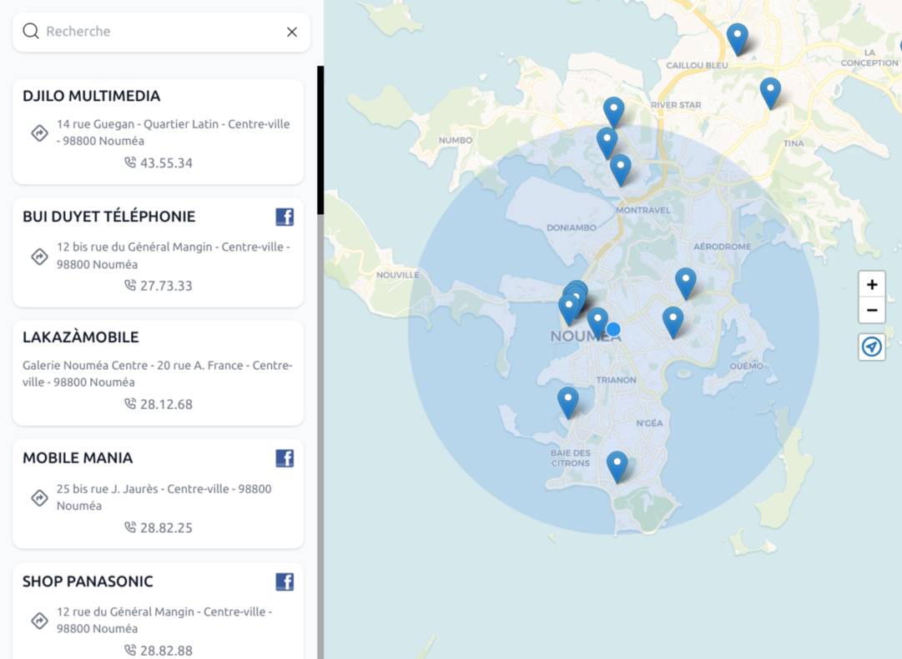
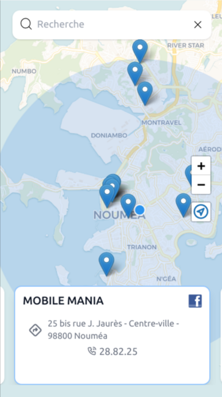

[](https://github.com/semantic-release/semantic-release)

[](https://hub.docker.com/repository/docker/optnc/api-partenaires-mobilis)


# 👉API des partenaires Mobilis de l'OPT-NC

POC d'intégration d'un service REST SpringBoot sous forme d'image Docker.
Ce service met à disposition la liste des boutiques de prestataires Mobilis, 
via notre [Marketplace d'API publiques](https://rapidapi.com/opt-nc-opt-nc-default/api/partenaires-mobilis/details).

## 📷 Screenshots

Version desktop                            |  Version mobile
:-----------------------------------------:|:-----------------------------------------:
 | 

## 🎥 Démos video

- [Téléphone](https://youtu.be/hGFMjtgEcxc)
- [Ordinateur](https://youtu.be/e7SbTiNPfWc)
- [Tablette](https://youtu.be/eW1LltvOPC8)

# 🕹️Jouer avec l'API tout de suite !

Un cours dédié a été créé sur KataCoda : https://www.katacoda.com/opt-labs/courses/partenaires-mobilis
Tout y est abordé, les feedbacks sont bienvenus, par des issues idéalement.

## Lancement en DEV

`./mvnw spring-boot:run`

## Description technique

Ce service se compose d'une base de donnée mémoire H2 chargé à chaque démarrage via le fichier `data.sql` qui insert le 
`partenaires.csv` dans la table `PARTENAIRE`.

Une base de données spactiale embarquée (http://www.h2gis.org/) permet de faire des interrogations sur des zones géographiques.

Les données sont exposées en REST Json/[GeoJSON](https://geojson.org/) pour pemettre une intégration dans un outil de visu le plus simplement possible.

```bash
curl http://localhost:8080/api/partenaires
```
```json
{
  "type": "FeatureCollection",
  "features": [
    {
      "type": "Feature",
      "properties": {
        "ville": "Bourail",
        "codePostal": "98870",
        "codeInsee": "98803",
        "quartier": null,
        "adresse": "5 A rue Simone Dremon - Village",
        "telephone": "44 33 55",
        "nom": "BOURAIL ELECTRONIC",
        "url_gmaps": "https://goo.gl/maps/nSZ25o1ogQWoFQjK7",
        "url_fb": "https://fr-fr.facebook.com/BOURAIL.ELECTRONIC/",
      },
      "geometry": {
        "type": "Point",
        "coordinates": [
          165.49879,
          -21.56877
        ]
      }
    }
    ...
  ]
}
```

## Exemple de requête de récupération par position géographique

Récupère les boutiques situées dans un rayon de 2000 mètres du point indiqué :
```bash
curl 'http://localhost:8080/api/partenaires?nearBy.lon=166.448744&nearBy.lat=-22.302828&nearBy.distance=2000' -H 'accept: application/json'
```

## Docker

Une image docker est générée via le plugin JIB pour maven (qui permet notamment de générer une image Docker sans avoir le client docker installé), elle peut-être lancée de la manière avec la commande suivante :
- `docker run --rm -p 8080:8080 optnc/api-partenaires-mobilis:latest` pour la denière à jour
- `docker run --rm -p 8080:8080 optnc/api-partenaires-mobilis:stable` pour la denière release

Pour tester : http://localhost:8080 depuis votre navigateur

### Images signés

L'image est signé avec l'outil [cosign](https://docs.sigstore.dev/cosign/installation), vous pouvez donc vérifier que l'image est correcte grâce à la [clé publique](./doc/cosign.pub) :
```bash
cosign -d verify --key cosign.pub  optnc/api-partenaires-mobilis:latest
```

## Doc de l'API REST

SwaggerUI accessible directement à la raçine du service http://localhost:8080/api depuis un navigateur
